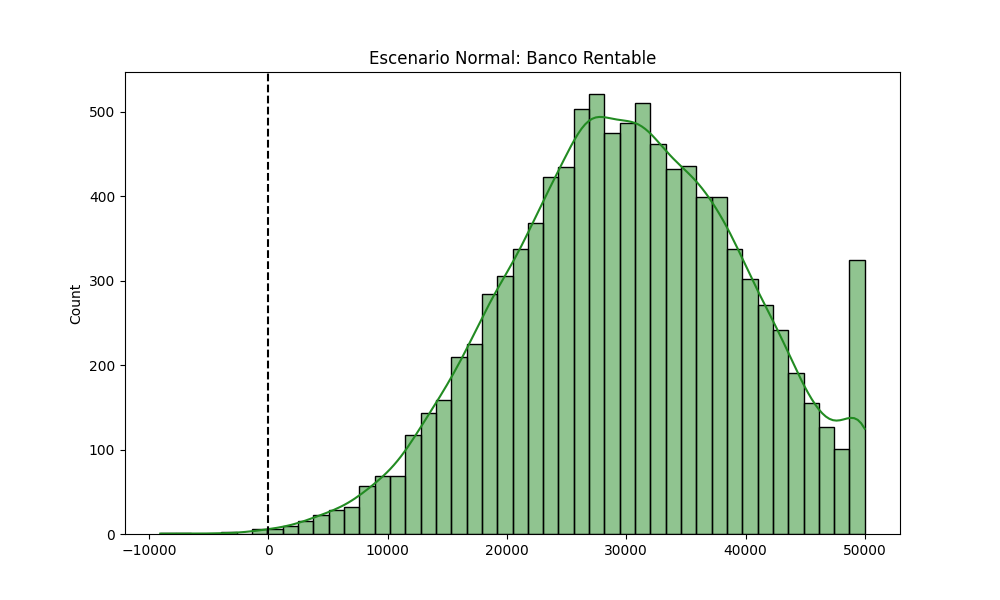
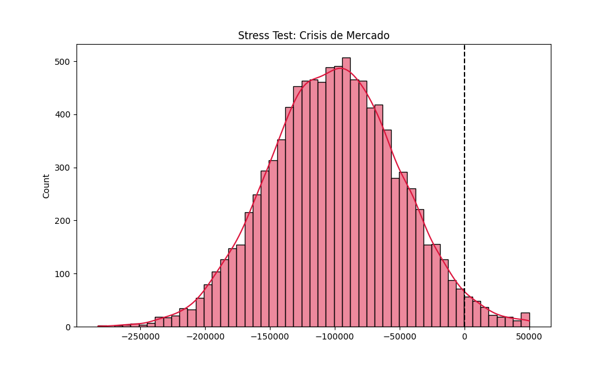
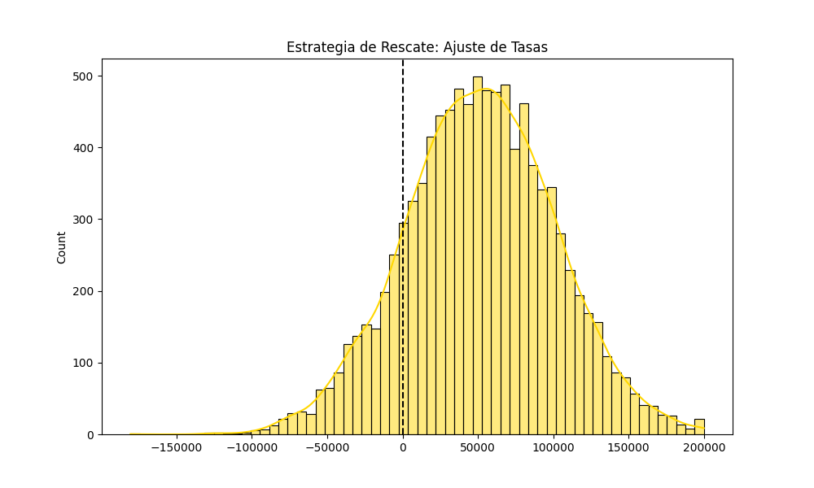

  

  # 🏦 Banking Risk Analytics: Monte Carlo Simulation & Stress Testing
  ### Quantifying Financial Exposure and Capital Resilience
  
  **Data Strategist | Risk Management & Predictive Modeling**
  
  
  

---

## 📈 Executive Summary
This project implements a **Monte Carlo Simulation** framework to assess credit risk and portfolio exposure. By simulating 10,000 market scenarios, we quantify the **Value at Risk (VaR)** and evaluate bank solvency under extreme volatility.

## 📊 Strategic Risk Scenarios

### 1. Normal Market Operations
Low volatility and stable default rates. The bank maintains a healthy profit margin.

### 2. Market Crisis (Stress Test)
Simulating a high-volatility event (Pandemic/Financial Crisis). We identify a **97% failure probability**, highlighting critical capital vulnerabilities.

### 3. Strategic Rescue (Recovery)
Implementation of **Risk-Based Pricing**. By adjusting interest rates, we restore the net profit margin and mitigate the impact of the crisis.

## 🛠️ Tech Stack
* **Python** (NumPy, Pandas)
* **Statistical Modeling** (Normal & Beta Distributions)
* **Data Visualization** (Seaborn, Matplotlib)

## 📈 Key Insights for Banking
* **VaR 95% Calculation**: Identifies the maximum potential loss in extreme scenarios.
* **Sensitivity Analysis**: Measures how changes in default rates affect total capital.
* **Strategic Decision Making**: Data-driven interest rate optimization.
